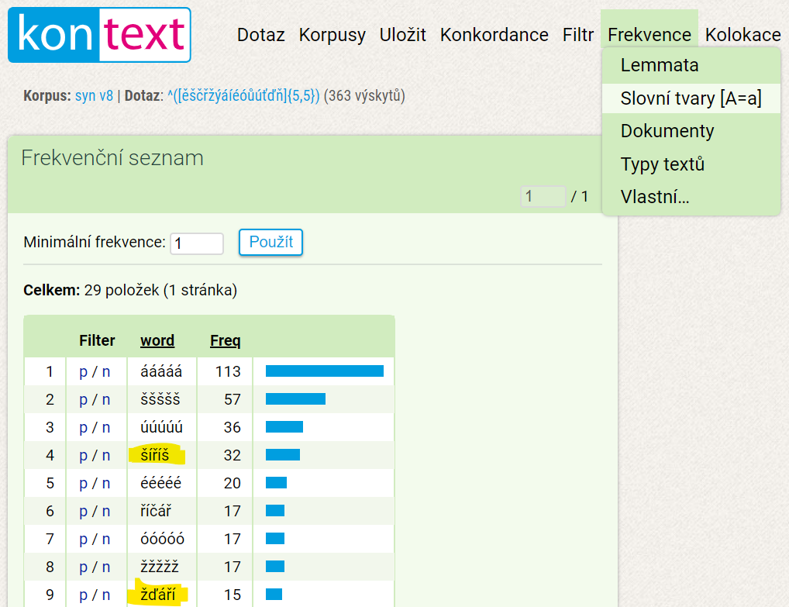
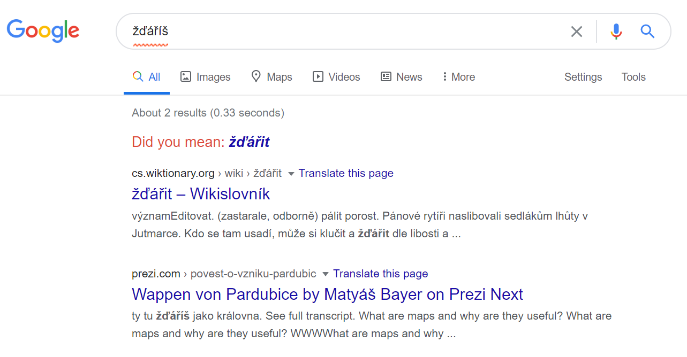

Čeština je charakteristická i tím, že nad písmeny se občas objeví háček či čárka. Napadlo mě najít to nejdelší slovo, které obsahuje pouze písmena s diakritikou.

## Číší šíříš

Bádání jsem započal přemítáním a nalezením slova **číší**.
Čtyři písmena mají i další slova: **říší**, **šíří**. Tvar slovesa šířit v druhé osobě přítomného času a jednotného čísla přidá k řešení další písmeno. **Šíříš** s pěti znaky je nejdelší slovo, na které jsem přišel pomyšlením. Na pokračování jsem přizval technologie.

## Hledání (v) seznamu slov

V první fázi to byla snaha získat seznam všech českých slov ve všech možných tvarech. Nyní můžu prozradit, že kompletní seznam neexistuje. Není ani jasné, kolik takových slov je ([hovoří se](http://nase-rec.ujc.cas.cz/archiv.php?art=3932) o několik milionech). Nejblíže jsem se dostal ke slovníku z [LibreOffice](https://extensions.libreoffice.org/en/extensions/show/czech-dictionaries) (v kancelářském balíku slouží ke kontrole pravopisu). Po odzipování jsem otevřel soubor `cs_CZ.dic`, což je jednoduchý texťák, který na každém řádku obsahuje jeden tvar. Nejdříve jsem musel změnit kódování na ISO 8859-2, aby se místo diakritiky nezobrazovaly nesmysly. Slovník obsahuje 166 565 tvarů. Kompletní tedy rozhodně není. Navíc obsahuje i tvary, které by si zasloužili podtržení červenou vlnovkou (áách,abeba,atd...). Co je však nejhorší v kontextu hledání dlouhého diakritického slova – neobsahuje ani šíří, říší, či číší. Ještě jsem na to zkusil jít regulárním výrazem `^([ěščřžýáíéóůúťďň]{3,})/`. Ten koná následující: hledej všechny výrazy od jejich začátku (`^`) obsahující pouze diakritická písmena `[ěščřžýáíéóůúťďň]`. Slova musí mít počet znaků větší než 3 `{3,}` a končit lomítkem (`/` končí každý výraz ve slovníku, za ním je uvedena zkratka slovního druhu). Takováto slova jsou tam pouze 3 (číš, Číž, říš). Mimochodem slovo [říš](https://cs.wiktionary.org/wiki/%C5%99%C3%AD%C5%A1) je spisovný (básnický) tvar a číš, či Číž vede až do [morku kostí](http://nase-rec.ujc.cas.cz/archiv.php?art=1003). S LibreOffice slovníkem to však nebyl úplně marný pokus. Se změnou regulárního výrazu na `^([ěščřžýáíéóůúťďň]{4,})` najdeme taky 3 slova (pouze jsme změnil minimální počet znaků na 4 a odstranil lomítko). Čížův, šířící a žďáření. Právě poslední zmíněné vede ke vítězi této soutěže.

## Spásný korpus

Při hledání slovníku jsem se progůglil k Českému národnímu korpusu a posléze k webové aplikaci [kontext](https://kontext.korpus.cz/first_form), která umožňuje dotazovat korpus (rozsáhlý soubor autentických textů) a to včetně pomocí regulárních výrazů. 

Slov o délce 5 obsahující pouze diakritická písmena [našel korpus](https://kontext.korpus.cz/view?ctxattrs=word&attr_vmode=mouseover&pagesize=40&refs=%3Ddoc.title&q=~7wjGy2BIRzDU&viewmode=kwic&attrs=word&corpname=syn_v8&attr_allpos=all) 363, většina z nich jsou však citoslovce.

Další funkci, kterou korpus nabízí je zobrazení pomocí frekvence výskytu. Sloučí to všechny ááááá a Ááááá a přehled se scvrkne na 29 položek.

Celkem vysoko se nachází **šíříš** a nově i **žďáří**, další slovo s 5 znaky. Zde je snadné provést "fintu" s převedením do druhé osoby jednotného čísla času přítomného a získáme navíc jedno `š`.

## Žďáříš !!!

**žďáříš** s 6 znaky je dle mého bádání vítězem tohoto diakritického klání. Korpus však o tomto slovu mlčí a s regulárním výrazem `^([ěščřžýáíéóůúťďň]{6,})` (tedy 6 a více znaků) nalezneme pouze citoslovce.

K dnešku (2020-07-24) jsou na Googlu pouze 2 záznamy tohoto slova. Jeden z [wiki slovníku](https://cs.wiktionary.org/wiki/%C5%BE%C4%8F%C3%A1%C5%99it) (důkaz, že žďáříš skutečně existuje) a druhé z jakéhosi přepisu prezentace.

Ještě pro informaci: Ždářit znamená vypalovat porost (lesní), především z důvodu získávání zemědělské půdy. Odtud máme například Žďárské vrchy, Žďár nad Sázavou atd...

---
