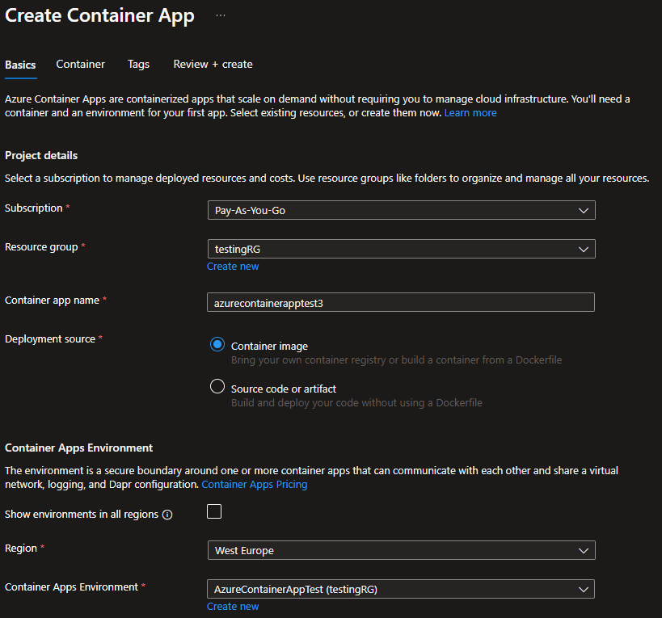
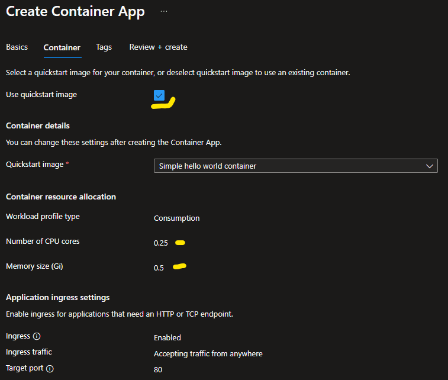
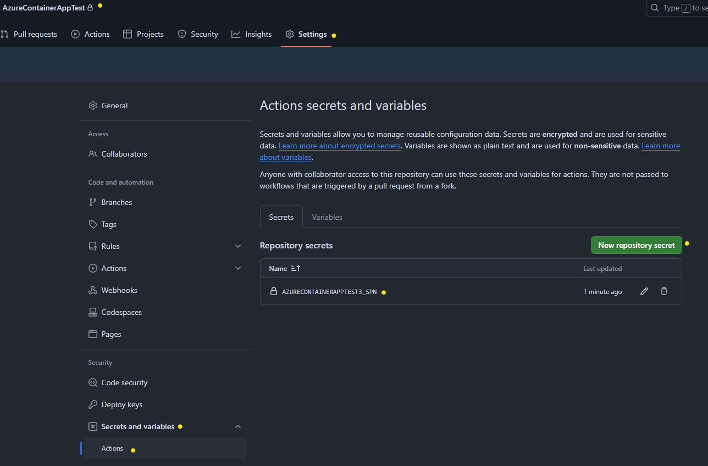
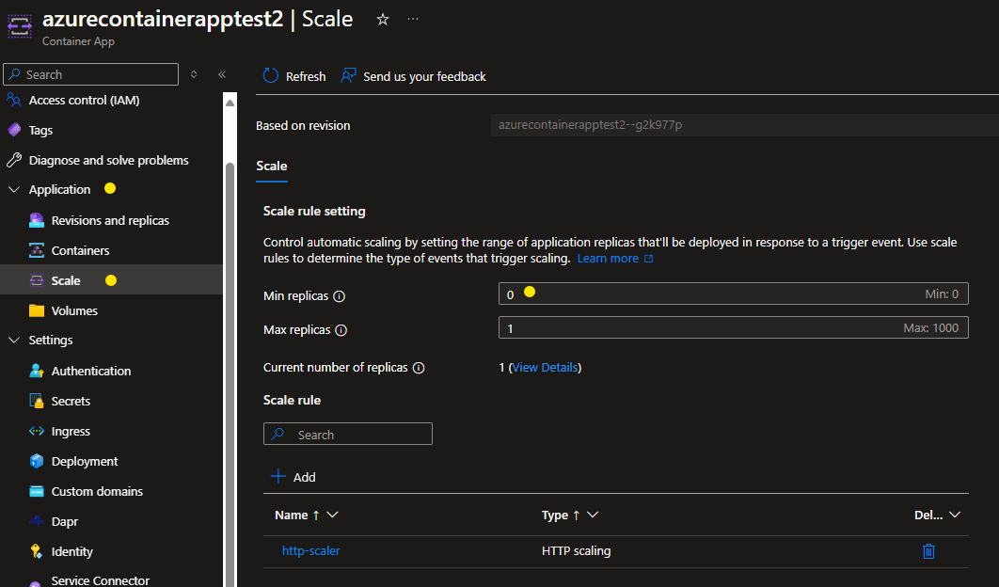

> This article was initially written for [Blazorise Blog](https://blazorise.com/blog/publishing-blazor-app-azure-container-app-github-container-registry).


This article aims to guide you through a cost-effective solution for hosting a single ASP.NET Core app on Azure Container Apps. By the end, we will have set up a CI/CD pipeline using GitHub Actions to build the app as a container, push it to the GitHub Container Registry (GHCR), and configure Azure Container Apps to pull and deploy the image.

We will cover all the necessary steps.

There are multiple ways to deploy to Azure. We will discuss a few options but focus primarily on a vendor-agnostic solution—one that does not depend on any specific IDE and can easily be adapted for other cloud providers or hosting environments.

## Creating the App

Start by creating a .NET 8 Blazor project using the following command:

```bash
dotnet new blazor --empty -o AzureContainerAppTest
```

Next, you'll need a `Dockerfile` to containerize your app. It can be easily generated by your IDE. In Visual Studio, right-click the project and select **Add** -> **Docker Support**. In JetBrains Rider, go to **Add** -> **Dockerfile**.

Your `Dockerfile` should look something like this:

```dockerfile
FROM mcr.microsoft.com/dotnet/aspnet:8.0 AS base
USER app
WORKDIR /app
EXPOSE 8080

# This stage is used to build the service project
FROM mcr.microsoft.com/dotnet/sdk:8.0 AS build
ARG BUILD_CONFIGURATION=Release
WORKDIR /src
COPY ["AzureContainerAppTest.csproj", "."]
RUN dotnet restore "./AzureContainerAppTest.csproj"
COPY . .
WORKDIR "/src/."
RUN dotnet build "./AzureContainerAppTest.csproj" -c $BUILD_CONFIGURATION -o /app/build

# This stage is used to publish the service project to be copied to the final stage
FROM build AS publish
ARG BUILD_CONFIGURATION=Release
RUN dotnet publish "./AzureContainerAppTest.csproj" -c $BUILD_CONFIGURATION -o /app/publish /p:UseAppHost=false

# This stage is used in production or when running from VS in regular mode (Default when not using the Debug configuration)
FROM base AS final
WORKDIR /app
COPY --from=publish /app/publish .
ENTRYPOINT ["dotnet", "AzureContainerAppTest.dll"]
```

Once your Dockerfile is ready, push the project to a private GitHub repository. A private repository will help us explore how to handle authorization for pulling the container image from GitHub. Of course, a public repository will also work, but using a private one adds a layer of security.

## Creating the App on Azure

We will use the Azure Portal to create the container app. Alternatively, you could do this through the Azure CLI or directly from the Visual Studio Publish wizard.

1. Go to the Azure Portal and search for **Container Apps**.
2. Click **Create** and fill in the form, similar to the screenshot below:

    

For this tutorial, I’ve created a dedicated resource group called `testingRG`.

During the process, you’ll need to create a **Container Apps Environment**. Just click `New`, provide a name, and leave the default options. This environment acts as the hosting environment for containerized apps, and we won't modify it in this tutorial.

3. In the **Resources** section, adjust the resource allocation to **0.25 CPU** and **0.5 GB** of memory. This keeps costs down. You can scale these settings later if needed.

    

4. Check the `Use quickstart image` option. This will deploy a basic container image, letting us focus on setting up the pipeline to deploy our Blazor app later.

After you finish these steps, click **Create** to deploy your new app. Once it’s ready, you can go to the resource and click on the **Application URL** to verify that the app is running. You should see a default "Hello World" message from the quick start image.

Next, we’ll configure the deployment of our custom Blazor app.

## CI/CD Pipeline (GitHub Actions)

The goal of this step is to create a GitHub Actions pipeline that will build the Docker image for our Blazor app, push it to GitHub Container Registry (GHCR), and deploy it to Azure Container Apps.

Below is the full `.yml` file for the GitHub Actions workflow. I will explain the individual parts afterward.

```yml
name: Build and deploy .NET application to Azure Container App using GHCR
on:
  push:
    branches:
      - master

env:
  CONTAINER_APP_NAME: azurecontainerapptest3 # name we set up in azure portal
  RESOURCE_GROUP: testingRG # azure resource group
  CONTAINER_REGISTRY_SERVER: ghcr.io # using github container registry
  DOCKER_FILE_PATH: ./Dockerfile # where our docker file is located
  PACKAGE_NAME: azurecontainerapptest/containertest #package name on ghcr.io.

jobs:
  build:
    runs-on: ubuntu-latest
    permissions:
      packages: write #need to setup the permission to create packages
      contents: read
    steps:
      - name: Checkout code
        uses: actions/checkout@v4

      - name: Set up Docker Buildx
        uses: docker/setup-buildx-action@v3

      - name: Log in to GitHub Container Registry
        uses: docker/login-action@v3
        with:
          registry: ${{ env.CONTAINER_REGISTRY_SERVER }}
          username: ${{ github.actor }} #github username
          password: ${{ secrets.GITHUB_TOKEN }} # github token from secrets

      - name: Build and push container image to GHCR
        uses: docker/build-push-action@v5
        with:
          push: true
          tags: ${{ env.CONTAINER_REGISTRY_SERVER }}/${{ github.actor }}/${{ env.PACKAGE_NAME }}:${{ github.sha }} 
          file: ${{ env.DOCKER_FILE_PATH }}

  deploy:
    runs-on: ubuntu-latest
    needs: build
    steps:
   
      - name: Azure Login
        uses: azure/login@v2
        with:
          creds: ${{ secrets.AZURECONTAINERAPPTEST3_SPN }} # Stored secret for Azure login

      - name: Update container app
        uses: azure/CLI@v2
        with:
            inlineScript: |
                az config set extension.use_dynamic_install=yes_without_prompt 

                az containerapp update --name ${{ env.CONTAINER_APP_NAME }} \ 
                --resource-group ${{ env.RESOURCE_GROUP }} \
                --image ${{ env.CONTAINER_REGISTRY_SERVER }}/${{ github.actor }}/${{ env.PACKAGE_NAME }}:${{ github.sha }} \

      - name: Logout
        run: az logout
```

### PACKAGE_NAME

```yml
env:
  PACKAGE_NAME: azurecontainerapptest/containertest #package name on ghcr.io.
```

`PACKAGE_NAME` is the identifier for the Docker image in GitHub Container Registry (GHCR). Since GitHub Packages uses the term "package" broadly (it can refer to NuGet packages, ZIP files, or container images), we're defining the repository (`azurecontainerapptest`) and the specific image (`containertest`). This variable is used throughout the workflow to ensure consistent naming for the image.

### Building and Pushing the Container Image

```yml
uses: docker/build-push-action@v5
with:
  push: true
  tags: ${{ env.CONTAINER_REGISTRY_SERVER }}/${{ github.actor }}/${{ env.PACKAGE_NAME }}:${{ github.sha }} 
  file: ${{ env.DOCKER_FILE_PATH }}
```
In this step, we are specifying the Dockerfile to containerize the Blazor app and using the `tags` parameter to name the container image. The image will be available at a location like `ghcr.io/username/azurecontainerapptest/containertest:e446edd16995a225d60482ab21bd55bbac88623a`, where `username` is your GitHub account name and `e446edd16995a225d60482ab21bd55bbac88623a` is the Git commit SHA.

### Azure Login

```yml
  uses: azure/login@v2
  with:
    creds: ${{ secrets.AZURECONTAINERAPPTEST3_SPN }}
```
Here we log in to Azure using credentials stored in GitHub secrets. You must generate these credentials on Azure and then store them in GitHub, as described below.

#### Generate secret

On your local machine (or in the Azure Portal), run the following command to generate a service principal with the appropriate permissions. This assumes the [Azure CLI](https://learn.microsoft.com/en-us/cli/azure/) is installed.


```bash
az ad sp create-for-rbac --name azurecontainerapptest3 --role contributor --scopes /subscriptions/--your-subscription-id--/resourceGroups/testingRG/providers/Microsoft.App/containerApps/azurecontainerapptest3 /subscriptions/--your-subscription-id--/resourceGroups/testingRG/providers/Microsoft.App/managedEnvironments/AzureContainerAppTest --json-auth
```

The three variables here are:
- the name of the container app: `azurecontainerapptest3` in my case
- `--your-subscription-id--` 
- `AzureContainerAppTest` as the environment we created together with the continer app


You will get a JSON response similar to this:

```json
{
  "clientId": "******",
  "clientSecret": "********",
  "subscriptionId": "yourSubscriptionId",
  "tenantId": "yourTenantId",
  "activeDirectoryEndpointUrl": "https://login.microsoftonline.com",
  "resourceManagerEndpointUrl": "https://management.azure.com/",
  "activeDirectoryGraphResourceId": "https://graph.windows.net/",
  "sqlManagementEndpointUrl": "https://management.core.windows.net:8443/",
  "galleryEndpointUrl": "https://gallery.azure.com/",
  "managementEndpointUrl": "https://management.core.windows.net/"
}
```

#### Store the secret on GitHub

Take this JSON output and go to your GitHub repository:
1. Navigate to **Settings** -> **Secrets and variables** -> **Actions**.
2. Add a new secret and paste the JSON as the value.

Use the secret name (e.g., `AZURECONTAINERAPPTEST3_SPN`) in the Azure login step.



### Update container app

```yml
uses: azure/CLI@v2
with:
    inlineScript: |
        az config set extension.use_dynamic_install=yes_without_prompt 

        az containerapp update --name ${{ env.CONTAINER_APP_NAME }} \ 
        --resource-group ${{ env.RESOURCE_GROUP }} \
        --image ${{ env.CONTAINER_REGISTRY_SERVER }}/${{ github.actor }}/${{ env.PACKAGE_NAME }}:${{ github.sha }} \
```

This command uses the Azure CLI to update the container app with the newly built image. The `--image` parameter points to the container image pushed to GHCR in the previous steps.

Now, when you push your changes to the GitHub repository, the action will run the pipeline. However, there’s one more thing we need to handle—giving Azure access to the GHCR.

### Allowing Azure to Access GitHub Packages

In order for Azure to pull the container image from GitHub Container Registry (GHCR), we need to grant it access by generating a Personal Access Token (PAT) from GitHub. Azure will use this PAT to authenticate against GHCR and pull the image.

#### Generate a PAT (Personal Access Token)

1. Go to your GitHub account.
2. Navigate to **Settings** -> **Developer settings** -> **Personal access tokens** -> **Tokens (classic)**.
3. Generate a new token with the `read:packages` permission.

> Note: As of now, GitHub's fine-grained access tokens do not support package access, so you will need to use a classic PAT.

Once the token is generated, you will see it displayed only once, so make sure to copy the token.

#### Configure Azure to Use the PAT

Now, use the Azure CLI to set up access to the GitHub Container Registry using the generated PAT. Replace the values in the following command with your own:

```bash
 az containerapp registry set --name azurecontainerapptest3 --resource-group testingRG --server ghcr.io --username tesar-tech --password ghp_yourpat
```

In this command:
- `--name` specifies the name of the Azure Container App.
- `--resource-group` refers to the resource group where the app is deployed.
- `--server` is set to `ghcr.io`, the GitHub Container Registry server.
- `--username` should be your GitHub username.
- `--password` is the PAT you just generated.

#### Verify the Secret in Azure

Once the command is executed, the PAT is stored securely in Azure. You can verify this by navigating to your Azure Container App:
1. Go to **Settings** -> **Secrets**.
2. You should see the registry credentials stored there.

This setup allows Azure to authenticate with GHCR and pull the container image during deployment.
 

#### Final Steps to Resolve Port Mismatch

At this stage, the pipeline should run successfully, but the app might not work immediately due to a port mismatch. The error typically looks like:

> "The TargetPort 80 does not match the listening port 8080."

To fix this:

1. Go to your Azure Container App in the portal.
2. Navigate to **Settings** -> **Ingress**.
3. Change the **TargetPort** to `8080` to match the port exposed in your Dockerfile.


Once updated, your app should now be running. You can verify this by going to **Overview** -> **Application URL** to check the live version of your app.


## Scaling to 0 Replicas

By default, even if you're not using your Azure Container App, you will incur costs. Running an app with the lowest resource settings (0.25 CPU and 0.5 GB RAM) costs approximately €5 per month, even during idle times. To avoid unnecessary charges when the app is not in use, you can scale the app down to 0 replicas.

When scaled to 0 replicas, the app will automatically turn off when idle and only spin up when there is traffic. This can be useful for testing or development environments where the app doesn't need to be constantly running. However, this configuration is not suitable for production since it adds a delay when traffic first hits the app, as the container needs to start up again.

From experience, the cold start time for an app scaling from 0 replicas usually takes around **20-30 seconds**, depending on the size and complexity of the container image ([source](https://github.com/microsoft/azure-container-apps/issues/997)). For a simple Blazor app, the startup time should be about **20 seconds**. Additionally, after **5 minutes** of inactivity (the default idle timeout), the app will scale back down to 0 replicas ([source](https://azureway.cloud/azure-container-apps-scaling-part-3/)).

To configure scaling to 0 replicas:

1. Go to your Azure Container App in the portal.
2. Navigate to **Scale** in the side menu.
3. Set the **Minimum replicas** to `0` and **Maximum replicas** to your desired value (for example, `1`).



By doing this, the app will scale down to 0 replicas during periods of inactivity, and Azure will automatically bring it back online when traffic hits.

This feature is an excellent way to save costs during development or testing phases without affecting the ability to scale back up when necessary.
