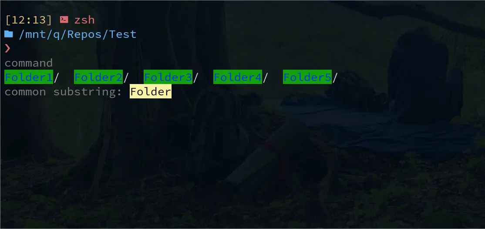
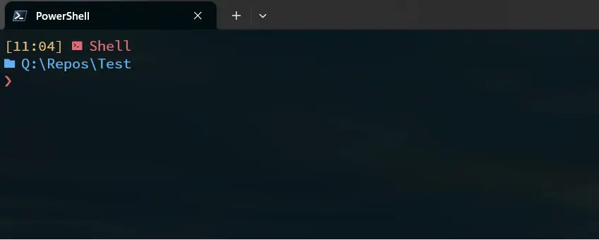
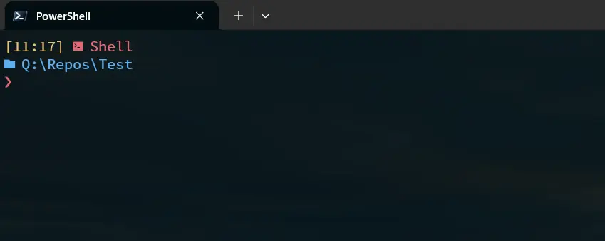

The final result:



As a long-time Windows and PowerShell user, I had previously optimized my terminal setup with Windows Terminal, oh-my-posh, and the PSReadline tool to create a streamlined experience:



One feature I particularly enjoy is the ability to preview the folder to *cd* into when pressing ctrl+space:



Now, I wanted to replicate a similar experience on a Linux machine—a task that’s not as straightforward. My motivation came from discovering NixOS’s powerful feature of reproducibility. With each setup and configuration captured in .nix files, I never lose my customized environment; it’s easy to reproduce and share. 

To get started, I used Home Manager for installation. Here’s a full, minimal example of `home.nix`:

```nix
{ config, pkgs, ... }:
{
  home.username = "nixos";
  home.homeDirectory = "/home/nixos";

  home.stateVersion = "24.05"; 

  home.packages = with pkgs; [
    oh-my-posh
    git
  ];

  programs.zsh = {
    enable = true;
    plugins = [
      {
        name = "zsh-autocomplete"; # completes history, commands, etc.
        src = pkgs.fetchFromGitHub {
          owner = "marlonrichert";
          repo = "zsh-autocomplete";
          rev = "762afacbf227ecd173e899d10a28a478b4c84a3f";
          sha256 = "1357hygrjwj5vd4cjdvxzrx967f1d2dbqm2rskbz5z1q6jri1hm3";
        }; # e.g., nix-prefetch-url --unpack https://github.com/marlonrichert/zsh-autocomplete/archive/762afacbf227ecd173e899d10a28a478b4c84a3f.tar.gz
      }
    ];

    oh-my-zsh = {
      enable = true;
      plugins = [ "z" ];
      extraConfig = ''
                # Required for autocomplete with box: https://unix.stackexchange.com/a/778868
                zstyle ':completion:*' completer _expand _complete _ignored _approximate _expand_alias
                zstyle ':autocomplete:*' default-context curcontext 
                zstyle ':autocomplete:*' min-input 0

                setopt HIST_FIND_NO_DUPS

                autoload -Uz compinit
                compinit

                setopt autocd  # cd without writing 'cd'
                setopt globdots # show dotfiles in autocomplete list
      '';
    };

    autosuggestion.enable = true;
    syntaxHighlighting.enable = true;
    history = {
      size = 10000;
    };

    # Extra configurations for Zsh
    initExtra = ''
      # Oh-My-Posh initialization for Zsh
      eval "$(oh-my-posh init zsh --config /mnt/c/Users/toted/OneDrive/prog/oh-my-posh/mytheme.omp.json)"

      # zsh-autocomplete
      bindkey -M menuselect '^M' .accept-line # run code when selected completion
        '';
  };
```

Some important notes:

- I chose Zsh over Bash because of its support for an enhanced user experience, especially with dropdown menu-style autocomplete, which Bash lacks ([source](https://unix.stackexchange.com/a/760480)).
- I installed `zsh-autocomplete` directly via Git rather than using zplug to ensure compatibility with how the final `.zshrc` is structured. Specifically, `oh-my-zsh` needs to be sourced before plugin configuration [[source](https://github.com/marlonrichert/zsh-autocomplete/discussions/723)].
- My prompt styling relies on `oh-my-posh`, though you can customize it to suit your preferences. `oh-my-posh` is optional, but I already had it set up in my PowerShell profile, so I extended its use in my Linux setup.
- For navigating command history, simply press the up arrow key; otherwise, the default context is set to `curcontext`. If preferred, you can set it to display history first with `zstyle ':autocomplete:*' default-context history-incremental-search-backward`.
- Shortcut `cd ..` is handled by a terminal shortcut (not part of this script).
- `setopt autocd` allows navigation into directories without explicitly typing `cd`.
- The `zsh-autocomplete` plugin also supports suggesting command parameters.
