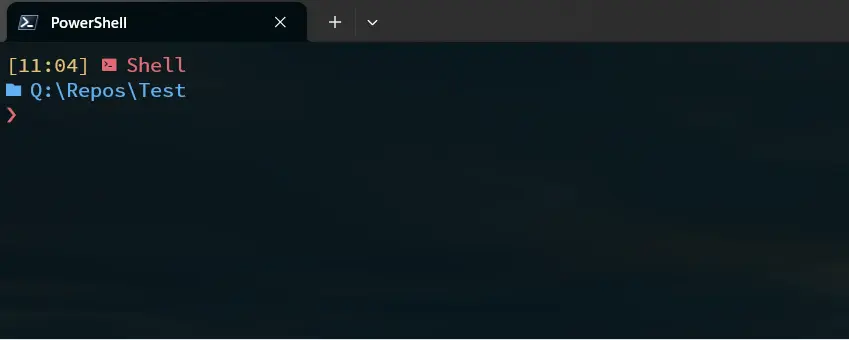

I have been long time user of Windows and powershell for all the terminal stuff. I have tune up the experinece with help of Windows Terminal, oh-my-posh and PSReadline tool. It looks like this

The second is to preview the folder to *cd* into when I press ctrl+space.

Now the task - reproduce such behavior on Linux. I run several different machines with linux with various purpose. I am rather enexperinced linux user - I am usually able to force it do what I force it to do.. . What bothers the most is when I do such customization it is hard to reproduce on other machine - well, it's not impossible, but cumbersome.. And I do need to remember the exact procedure, install this, that, change this file, source, etc.. Usually I end up with a guide. Which opens up a new problem - to maintain the guide. Where to store it, how to access it, how to keep it up to date.. Usually it ends up with me doing it on one machine which waste all my energy I am willing to put on it, which results in not doing the documentation the thing.. "I will remeber it for the next time". No I wont. Thus the result is usually reconsiliation with unperfect setup and just letting it be...

And now - behold - NixOs solves all that... Usually it takes up more energy to set things up. But I impute that on my ineprerince with nix languge. But even though - the setup is there, all in one file or git repository, just ready do be reproduced on other machines - machines that doesn't even need the have the NixOS installed, because nix package manager does exists. The problem with guide/documentation? Non existent. You keep everything in one code file where you can paste comments. The whole process is self-documenting. You could argue - "I can do all this with a bash script". Yes, you can and it would work eventually, but I guess it would be overhelming pretty soon. For example my linux setup for the autocompletion requires zsh and oh-my-zsh and (of course) editing the `.zshrc` file. If you would create custom configuration bash scrip, how do you make sure that `.zshrc` runs the `source $ZSH/oh-my-zsh.sh`? You will prepend it every time? You will check for its presence? What if there is a need to run it on a specific place, etc.. Can be overcome, but it's gonna get messy and on the end you would actually create someting like the nix language. It's better to use it right away...

So, nix (os and language) solves it by declaring how it should look like on the end (the .nix files). When you apply the .nix files it will take it as a description and scafold for example the .zshrc for you (yes, in nix os your dot files are readonly - you change them through .nix files - sounds like extra steps, but there is the declarative argument).

Now I will show how the description for the beafutiful zsh does look like. 

