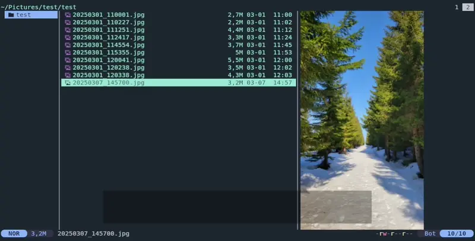

I don’t want cloud magic handling my photos. I want tools that do what I tell them, live on my machine, and don’t get in the way. This is about setting up a simple, fast workflow with Yazi and NixOS that lets me organize and convert my images exactly how I want—no bloat, no waiting, no black mirrors.


## Introduction (to Yazi) 

Yazi is a fantastic tool for managing folders and files. Its biggest strengths—at least for me—are its speed, ease of use (thanks to configurable keyboard shortcuts), and straightforward extensibility. In this article, I’ll show how to extend Yazi’s functionality with quick image conversion options, specifically converting JPG files to WebP.


I prefer WebP because it offers a better size-to-quality ratio, reducing file size while maintaining visual quality. My phone captures photos in JPG format with unnecessarily high resolution. With Yazi, I have the perfect tool to categorize those photos using a simple folder structure—and, with a bit of configuration, also a convenient way to change their format and resolution.


## Why Nix?

One great advantage of Nix configuration—especially in this case—is that everything is centralized in one place: a single file or repository.

You don’t need to scatter scripts across different locations, modify configurations manually, or install dependencies separately. One configuration file ensures everything is installed and set up correctly on your system.


Another major benefit is reproducibility. With Nix, you can move your configuration file to another machine, apply it, and everything will work exactly as it does on your original setup.

You can install Yazi by placing this in your configuration:

```nix
home.packages = [ pkgs.yazi ];
```

I don’t mind spending a significant amount of time configuring a tool like this in Nix—because I know it will be there for me on any new machine, just one command away:

```
home-manager switch --flake path/to/your/flake
```

## Motivation

I use Yazi for nearly all file operations—organizing, copying, deleting, transferring, and opening files. I use it for navigation, as it provides a three-level directory structure view and integrates well with `zoxide` for quick directory switching. But that’s a topic for another article...

### Organizing photos

One specific use case where I find Yazi especially useful is organizing my photos. Pictures from my phone are synced to my computer via `syncthing`, and I need to sort them into a structured folder hierarchy. I always did this manually, but now with Yazi it becomes fast and actually enjoyable.

```
Photos/ (dummy names to  illustrate the structure) 
├── 2023/
│   ├── 0303_Birthday Bash
│   ├── 0722_Beach Days Begin
│   ├── 1224_Christmas Eve Dinner
│   └── ...
├── 2024/
│   ├── 0209_Ski Weekend Escape
│   ├── 0515_Spring Garden Tour
│   ├── 0910_Weekend in the Woods
│   └── ...
├── 2025/
│   ├── 0101_New Year Fireworks
│   ├── 0418_Easter Egg Hunt
│   ├── 0812_Summer Festival Fun
│   └── ...

```

### "Photo cloud" maybe?  

Sure, you could use cloud services like Google Photos or Apple Photos—but then your images are stored remotely, tied to an account you might lose, subject to platform lock-in, and not under your direct control. Cloud platforms can also change unexpectedly—pricing models, storage limits, or features might be altered or removed without notice. Privacy is another concern: even with encrypted connections and “private” accounts, your data is still handled by third parties, often used for analytics or machine learning. That’s fine for many people, but I prefer having my memories stored locally.


<figure style="display: flex; flex-direction: column; align-items: center; text-align:center; gap: 0.5em;">
  
  <figcaption >
  For a long time, I used Microsoft OneDrive to sync my photos from my phone to my desktop. It usually worked well — most of the time. But the constant nudging to buy more storage and the never-ending 'keep your photos with us – it’s totally safe!' narrative started to wear me down.</figcaption>
</figure> 

## Converting Photos

My phone captures images in JPG format at 4032x2268 resolution, typically around 2.5MB per image. I don’t need that many pixels, and WebP generally results in smaller file sizes compared to JPEG (on average, a 25% reduction in my tests).

This simple Bash command converts a JPEG image to WebP with a maximum resolution of 3000px:

```sh
magick photo.jpg -resize '3000x3000>' -quality 80 photo.webp
```

The quality is set to 80, which strikes a balance between file size and visual quality.  
**In practice:** the difference is barely noticeable, and file sizes shrink fast.


You can install ImageMagick on NixOS with:

```nix
home.packages = [ 
      pkgs.yazi #from previous step
      pkgs.imagemagick
       ];
```

## Integrating Image Conversion into Yazi

Yazi makes it easy to customize keyboard shortcuts, allowing you to execute commands on selected files. By pressing `e` in Yazi, you can trigger a shortcut menu with predefined actions.


The following Nix configuration sets up these shortcuts:

```nix
programs.yazi = {
  keymap.manager.prepend_keymap = [
    {
      run = ''
        shell '~/scripts/photo-processor.sh 80 "3000x3000>" 6 "$@"' --confirm
      '';
      on = ["e" "e"];
      desc = "Convert (3K, method 6, q80)";
    }
    {
      on = ["e" "q"];
      run = ''
        shell '~/scripts/photo-processor.sh "" "3000x3000>" 6 "$@"' --confirm --block
      '';
      desc = "Convert - custom quality";
    }
    {
      on = ["e" "r"];
      run = ''
        shell '~/scripts/photo-processor.sh 80 "" 6 "$@"' --block --confirm
      '';
      desc = "Convert - custom resolution";
    }
    {
      on = ["e" "x"];
      run = ''
        shell '~/scripts/photo-processor.sh "" "" "" "$@"' --block --confirm
      '';
      desc = "Convert - all custom";
    }
  ];
};
```

Each shortcut calls the `photo-processor.sh` script with different arguments, allowing customization of the final resolution, WebP quality, and compression method.

### Setting Up the Script

I store the script in the same folder as my Yazi settings and ensure Nix places it in `~/scripts/photo-processor.sh`:

```nix
home.file."${scripts.photo-processor}" = {
  source = ./photo-processor.sh;
  executable = true;
};
```

The `scripts` variable is defined in a `let` block:

```nix
let
  scrDir = "scripts";
  scripts = {
    photo-processor = "${scrDir}/photo-processor.sh";
  };
in {
  # Configuration continues...
}
```

## The `photo-processor.sh` Script

The script below is a Bash wrapper for ImageMagick's `magick` command. It takes in optional parameters for image quality, resolution, and WebP method. If these values aren't provided when the script is invoked, it prompts the user to input them interactively (with default values). It then iterates through the selected files, checks for supported formats (JPG, JPEG, PNG), and converts each image to WebP using the provided parameters. While converting, it shows simple progress reporting and skips unsupported file types.

```sh
#!/bin/bash

prompt_if_empty() {
  local var_name="$1"
  local prompt_text="$2"
  local default_value="$3"

  if [[ -z "${!var_name}" ]]; then
    echo -n "$prompt_text ($default_value): "
    read input
    eval "$var_name='${input:-$default_value}'"
  fi
}

QUALITY="$1"
RESOLUTION="$2"
METHOD="$3"

prompt_if_empty QUALITY "Enter quality" "80"
prompt_if_empty RESOLUTION "Enter resolution" "3000x3000>"
prompt_if_empty METHOD "Enter WebP method" "6"

shift 3

TOTAL_FILES=$#
CURRENT_FILE=0
shopt -s nocasematch

for file in "$@"; do
  ((CURRENT_FILE++))
  ext="${file##*.}"
  base="${file%.*}"

  if [[ "$ext" =~ ^(jpg|jpeg|png)$ ]]; then
    echo -ne "[${CURRENT_FILE}/${TOTAL_FILES}] Processing: $file\r"
    magick "$file" -resize "$RESOLUTION" -define webp:method="$METHOD" -quality "$QUALITY" "$base.webp"
    echo -ne "\e[2K\r[${CURRENT_FILE}/${TOTAL_FILES}] ✅ Done: $base.webp\n"
  else
    echo "[${CURRENT_FILE}/${TOTAL_FILES}] ❌ Skipping unsupported file: $file"
  fi

done
shopt -u nocasematch
echo "Processing complete! Converted $CURRENT_FILE/$TOTAL_FILES files."
```

## The final result



This setup lives in my terminal and does exactly what I need—fast photo sorting and conversion, no clicks, no fluff. It works for me, but Yazi’s flexible enough to bend to whatever workflow you throw at it.

