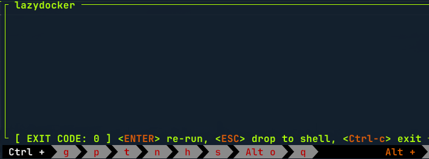
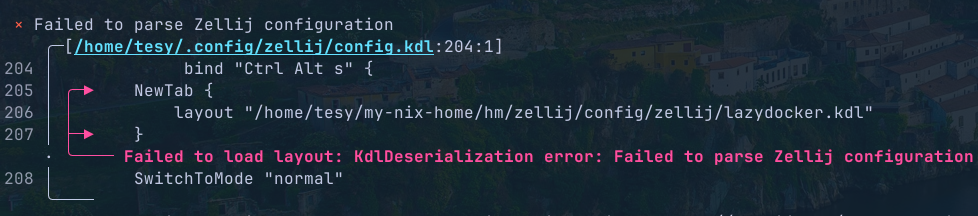

Zellij has many features that simplify terminal workflows. However, some actions, like quickly opening a **new tab** running a specific tool, aren’t immediately obvious.

For example, I wanted this behavior:

> Pressing `Ctrl+Alt+t` should open a new tab running `lazydocker`.

Here’s how to make that happen.

## Pane maybe?

Btw - opening lazydocker inside a new **pane** is easy:

```cs
shared_except "locked" {
  bind "Ctrl Alt t" {
    Run "lazydocker" {
    }
  }
}
```

The complicated bit is about tabs. I am more a tab person rather than a pane one - I use panes rarely, I like my full screens most of the time.

## Step 1: Add a Keybinding

Edit your Zellij config file:

```cs
// ~/.config/zellij/config.kdl

shared_except "locked" {
  bind "Ctrl Alt t" {
    NewTab {
      layout "/path/to/lazydocker.kdl"
    }
    SwitchToMode "normal"
  }
}
```

This tells Zellij to open a new tab using a custom layout whenever you press `Ctrl+Alt+t`.

## Step 2: Define the Layout

Create the layout file that runs `lazydocker`:

```cs
// /path/to/lazydocker.kdl

layout {
  default_tab_template {
    pane size=1 borderless=true { plugin location="tab-bar" }
    children
    pane size=1 borderless=true { plugin location="status-bar" }
  }

  tab name="LazyDocker" {
    pane command="lazydocker"
  }
}
```

Now pressing `Ctrl+Alt+t` launches LazyDocker in a new tab.

## Handling Exit Behavior

By default, when `lazydocker` exits, you’ll see the "Zellij run command wrapper" screen:


Sometimes that’s useful (for example, when running `ssh`), but sometimes it’s annoying. You have two ways to handle it:

**Option 1 - Close the tab when the process exits:**

```cs
tab name="LazyDocker" {
  pane command="lazydocker" close_on_exit=true
}
```

**Option 2 - Drop back to your shell instead:**

```cs
tab name="LazyDocker" {
  pane command="zsh" {
    args "-lc" "lazydocker; exec zsh"
  }
}
```

## Notes and Caveats

- You need to **detach and reattach** your session for layout changes to take effect.
- If there’s a syntax error in your layout, Zellij reports it at startup but doesn’t pinpoint the location:

  ```sh
  Failed to load layout: KdlDeserialization error: Failed to parse Zellij configuration
  ```

  
  - you can see the what's wrong with the layout by running

    ```sh
    zellij --layout ./lazydocker.kdl
    ```

Creating a layout for each tool can feel verbose, but it’s powerful once set up. I later built an FZF-based selector to launch tools like LazyDocker, Yazi, or SSH sessions on demand - that’s a topic for another article.
