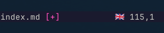

I am gradually moving all my text editing to Neovim. One of my common tasks is writing longer text: emails, docs, and blog posts like this one.

<figure style="display: flex; flex-direction: column; align-items: center; text-align:center; gap: 0.5em;">
  
  <figcaption >
Working spell check in nvim - with statusline indicator.
  </figcaption >
</figure>

Spellcheck is something that “just works” in browsers and many editors.

My setup is slightly trickier because I need to write in two languages: English and Czech.

In Neovim you enable spellcheck with:

```sh
:set spell
```

To set the language:

```sh
:set spelllang=cs
```

This is where I got stuck. Neovim did not have the Czech dictionary and did not show the usual prompt to download it.

If you see something like:

```sh
Cannot find word list cs.utf-8.spl or cs.ascii.spl
```

the fix for me was this [Christmas comment](https://github.com/neovim/neovim/issues/2102#issuecomment-269100273) from 2016:

> I found that some plugins for enhancing spell capability somehow disable the prompt. I started `nvim -u none` then run `:set spell` and `nvim` prompted me to download the file.

I did exactly that, Neovim downloaded the dictionary, and Czech spellcheck started working.

## Making it usable: toggling spellcheck

Spellcheck is not something I want on all the time.

I keep it disabled by default and control it via keymaps.

Neovim allows multiple languages at once:

```sh
:set spelllang=en,cs
```

I avoid this, because it introduces a few annoying **false positives** and misses. For example:

- `síť` is “net” in Czech, but `sit` is invalid in Czech, but a valid English word and would not be flagged by a mixed spellchecker.

Instead I use two small toggles:

- `<Leader>na`
  - if spellcheck is off or set to English → switch to Czech
  - if spellcheck is already Czech → turn spellcheck off

- `<Leader>ne`
  - if spellcheck is off or set to Czech → switch to English
  - if spellcheck is already English → turn spellcheck off

```lua
local function toggle_spell(lang)
  local spell_on = vim.opt_local.spell:get()
  local current_langs = vim.opt_local.spelllang:get()
  local current_lang = spell_on and current_langs[1] or nil

  if current_lang == lang then
    vim.opt_local.spell = false
    return
  end

  vim.opt_local.spell = true
  vim.opt_local.spelllang = { lang }
end

vim.keymap.set("n", "<leader>ne", function()
  toggle_spell("en")
end, { desc = "Toggle English spell checking" })

vim.keymap.set("n", "<leader>na", function()
  toggle_spell("cs")
end, { desc = "Toggle Czech spell checking" })
```

## Statusline indicator

- Spellcheck on ⇒ show a flag emoji for the active language
- Spellcheck off ⇒ show nothing special



How you wire this depends on your statusline plugin, if any.

I use a simple custom function:

```lua
function _G.SpellStatusFlag()
  if not vim.opt_local.spell:get() then
    return ""
  end

  local lang = vim.opt_local.spelllang:get()[1]
  if not lang or lang == "" then
    return ""
  end

  local flag = ({ en = "🇬🇧", cs = "🇨🇿" })[lang] or lang
  return " " .. flag
end

vim.opt.statusline = "%<%f %h%#StatusModified#%m%*%r%=%{v:lua.SpellStatusFlag()} %-14.(%l,%c%V%) %P"
```

## Next

This is only the first step in my Neovim text-editing journey; more tweaks will follow.
