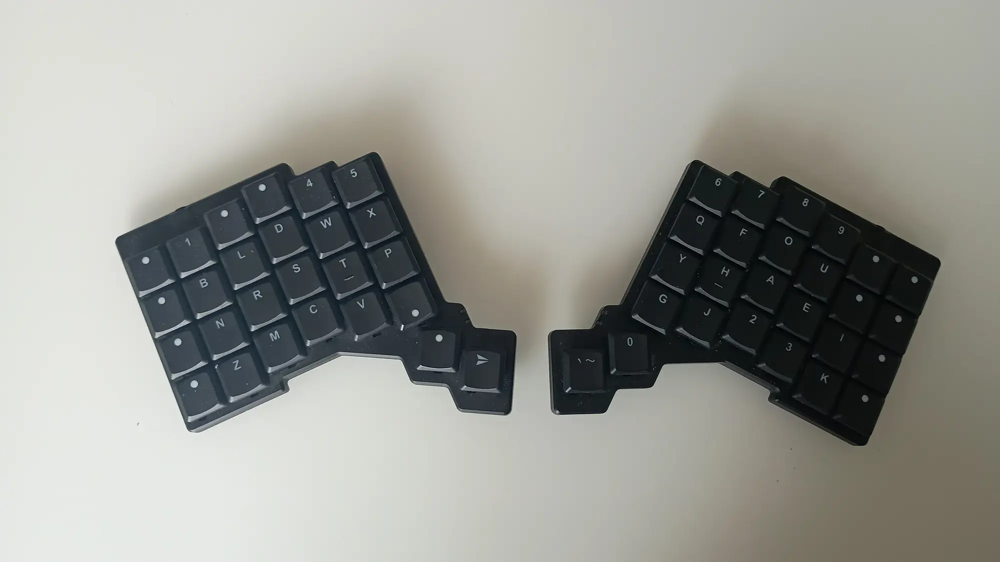
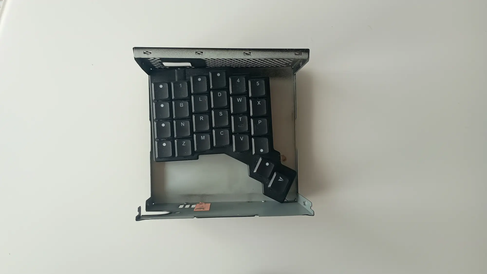
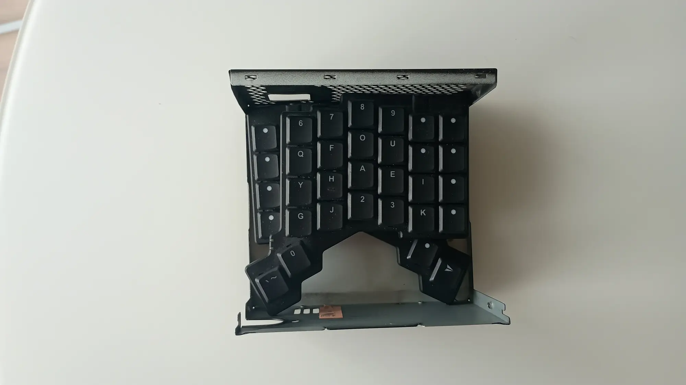
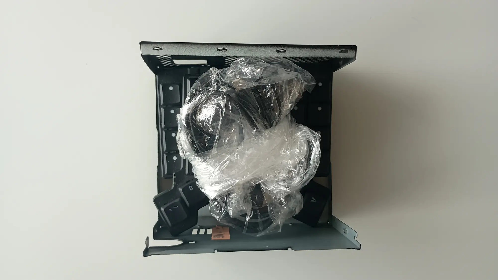
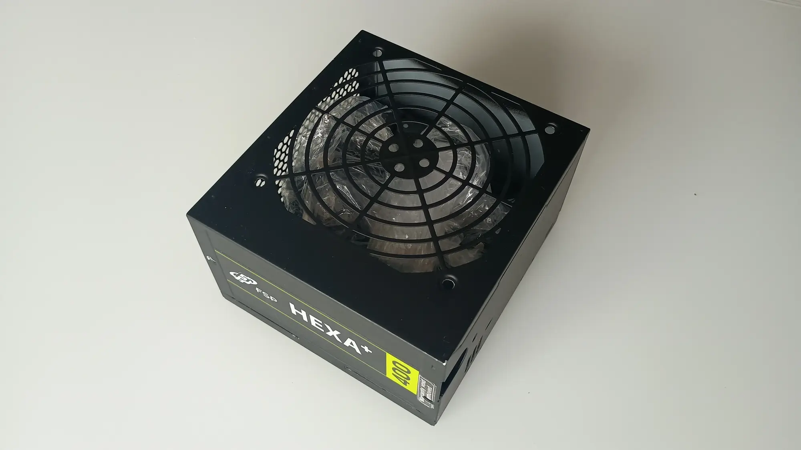
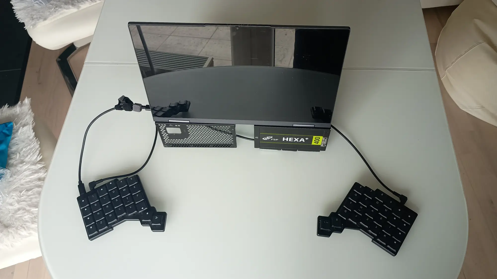

The ZSA Voyager is close to a perfect travel keyboard for me. Its split layout keeps it compact, and that matters because I carry an external keyboard often.

I used to travel with a full-size keyboard. It was bulky, awkward to fit into a backpack, and putting it into checked luggage was a good way to end up with damaged keycaps or switches.

That is where the Voyager, and split keyboards in general, really shine. With the default soft case, it packs down nicely and easily fits into a backpack.

The weak point is protection. The soft case is fine for storage, but I still need to be careful not to press anything heavy against it.

I found an accidental solution when a desktop PC power supply died and I removed it from the case. The empty metal shell ended up sitting on my desk near the Voyager, and the size looked suspiciously similar.

It turned out to be almost a perfect fit.

Even better, the Voyager's magnetic tripod pods lightly stick to the metal shell, which helps keep both halves from moving around inside.

So here it is: my improvised ZSA Voyager hard case.

The two halves stack neatly on top of each other.

I put the cables into a small plastic bag and place them on top. Besides keeping things tidy, the bag works as a bit of padding so the parts do not rattle around.

Once closed, the package is compact and much better protected than with the original soft pouch.

It is not perfect. Closing the metal shell takes a little practice because the grooves and tabs need to line up in a few places. Still, after a couple of tries, packing it takes maybe 15 seconds.

As a bonus, the shell can also work as a simple stand for my laptop.

