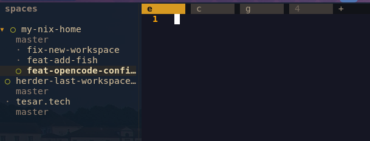
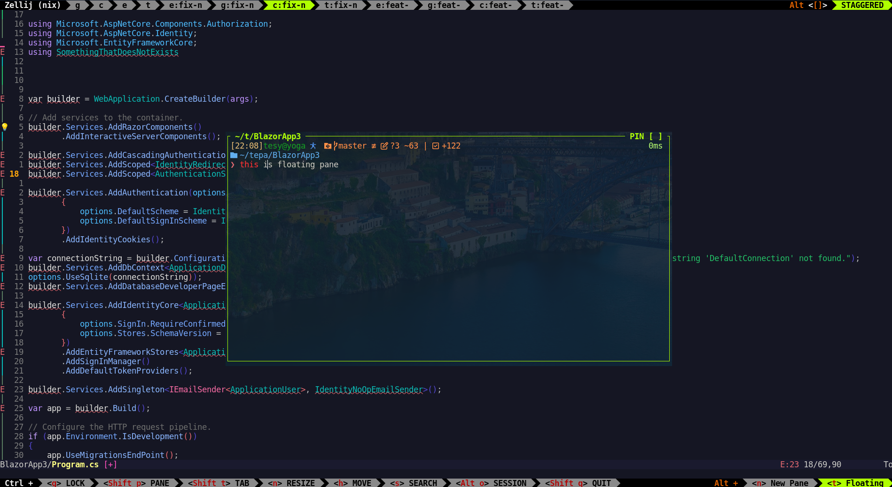
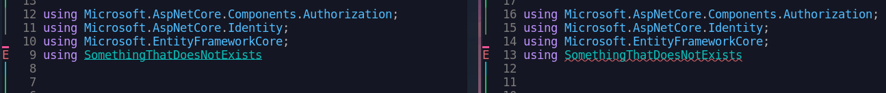
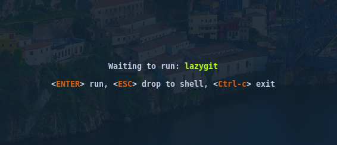

I have been using [Zellij](https://zellij.dev/) for more than a year. It was the logical step on Linux. The primary reason why I started with Zellij (and not tmux) was the simplicity.

You can just start with

```sh
bash <(curl -L https://zellij.dev/launch)
```

and then it teaches you how to navigate using keyboard shortcuts with the bottom bar. Amazing.

## Where zellij was not enough

I slowly integrated Zellij sessions into my daily workflow and it worked - almost flawlessly.

But then I started working on projects where multiple Git repositories are needed and multiple branches need to be accessible.

The branch issue is easily solvable with [Worktrunk](https://worktrunk.dev/). It takes away all the hard work when creating a new branch and a new worktree...
I scripted the whole thing so that on ctrl+alt+n, Zellij asks for a worktree (branch) name and opens 4 tabs with nvim, lazygit, opencode and just a command line (in that specific worktree location). With that I have a fresh environment for the next feature, or I can review pull requests without disturbing the workflow...

But these 4 tabs... are another 4 tabs in the limited space of the Zellij tab bar. And I also need to name them accordingly. So I usually use a convention with the branch's first 5 letters and `e` for nvim, `g` for lazygit, `c` for opencode and `t` for the terminal... Realistically, I could fit 3-4 of these "workspaces" on my screen (the one with no suffix is the base branch).


3-4 is not enough and the navigation becomes quite cumbersome. So what can one do? Use Zellij sessions? Session management is not the best in Zellij, and even then, I want to be able to switch fast and have all the trees closer to my eyes. A session is not for that - one session means one project, not one worktree. It would mix the "structure levels".
Another solution could be stacked panes, but then I would have to have one tab per tree and stacked panes inside. Maybe workable, but not perfect.

Then I was introduced to [Herdr](https://herdr.dev/) and the sidebar piqued my curiosity - this is exactly what I need - or at least, I thought so.

So I tried experimenting with it.

## Sidebar - clear win for Herdr

I am a fullscreen person - I don't like panes in a multiplexer, and I don't like them in Hyprland. I want everything fullscreen. The sidebar breaks this, but I figured I am fine with that. It really gives you



Four tabs, or it can be more - they are named simply (no suffix). This is something I was looking for.

Then there is the agent integration. It is described as the main Herdr feature. I find it useful, but not something that would force me to switch the multiplexer.

It is worth noting that there is a new [zj-radar](https://github.com/marktoda/zj-radar) project that solves exactly that - a sidebar with agents included.

## Worktrees integration - I would rather keep it unix-style

Herdr has basic worktree creation/deletion integration - and it is not great. What I mainly dislike is the need to store the worktrees in a separate worktree folder. The best solution for me is to store the worktrees at the same level as the base repo: `Repos/my_cool_project` and `Repos/my_cool_project.some-new-feature`... That is exactly how [Worktrunk](https://worktrunk.dev/) does it - and you can create hooks, etc. It does one job and it does it well. Fortunately, there is this [herdr-worktrunk extension](https://github.com/devashish2203/herdr-worktrunk/) that replaces the default worktree management with the Worktrunk tool.

In Zellij, the basic worktree operations were plain command scripting - in Herdr we need more because we have the sidebar.

## Images - Herdr has them now, Zellij has not for 3 years

[This Zellij issue](https://github.com/zellij-org/zellij/issues/2814) is from September 2023 (with 300+ thumbs up). Herdr has the Kitty graphics protocol in experimental features - and it works.

(Your terminal emulator has to support the protocol too - most terminal emulators do, but, for example, the fastest of them - foot - does not.)

## Shortcuts - both can be configured the same, but Herdr does it better

These are defaults - Zellij has different modes for tab operations (ctrl+t) and pane operations (ctrl+p), while Herdr has the tmux-style ctrl+b... I don't care much. The actions I use most of the time are remapped so they do not collide with the apps inside or the system, and I had no issues with either alternative.

## Floating panes - Zellij does it right

It's one of the proclaimed Zellij features - floating panes as first-class citizens. You map it to a shortcut, and when you press it, the floating panes appear - you can have several of them, and each tab has a different stack of floating panes. When you press the shortcut again, all of them disappear. But when you run some task there, it is still running in the background.



Herdr supports floating panes from 7.4, but they are hit-and-go - you cannot put them into the background with a second key combination press. I had to find ways around it - it usually means creating another tab - and since the tab bar is not crowded thanks to the workspaces, I can afford it.... But still, I would welcome this feature in Herdr too.

## Scripting the UI - both the same (almost)

You can create a named tab and run a command in both:

```sh
zellij action new-tab --name editor -- nvim
pane_id=$(herdr tab create --label editor --focus | jq -r '.result.root_pane.pane_id'); herdr pane run "$pane_id" nvim
```

It was not possible in Zellij, but it is now. Herdr is based on that - you can even instruct the agent to create new tabs/panes to spawn new agents in them. I never use that, but a lot of people find it useful.

## Text underlines in nvim - Herdr is lacking

It is [this issue](https://github.com/ogulcancelik/herdr/issues/1178), and it is quite a problem for me. Look at this C# code in nvim:



Herdr is on the left, Zellij is on the right - where the support for squiggly lines is proper. The red one under the exact error makes it visually obvious what is happening.

## Delete direction - last used vs left direction

In Zellij, when you close a tab, you jump to the one that was used last (similarly to how Brave does it). In Herdr, you jump to the one on the left - similarly to how qutebrowser does it.

I prefer the more deterministic one - but what I would prefer even more is a setting for this (also with the direction), which is not available in either multiplexer.

## Hard-to-reproduce bugs (that are not in Herdr)

Sometimes in Zellij, when I create a new tab, it just freezes and I cannot jump to any other tabs - I didn't find out why exactly...
Also, when creating a new tab, the location does not match the location of the tab where I was. Most of the time this happens when opening a floating pane. Not always, and I didn't find the cause or manage to reproduce it...

In Herdr, I don't have these issues.

## Moving tabs - in Herdr just with the mouse (??)

In Zellij, you can move tabs using keyboard shortcuts. In Herdr there is no such option ([the discussion](https://github.com/ogulcancelik/herdr/discussions/771)) - you can just drag and drop with the mouse, though. This is not such an issue when the tab count has decreased thanks to workspaces - but still, I would like to see this API in Herdr.
You can do a lot of stuff with the mouse in Herdr - but honestly, I don't care about this one.

## Session restoration - not needed anymore

Herdr restores tab names and working directories, but it does not offer to rerun the previous commands. Zellij does - you can press Enter to rerun each detected command:



But it is not always the best. The command detection is not perfect. For example, with opencode it often wants to start the LSP server used by opencode instead of opencode itself. I had the same issue with nvim. I found workarounds, but I don't miss this feature in Herdr. The restored tabs start with a command line and remember their names and locations. I created a script that reads the names and starts nvim for `e`, lazygit for `g`, opencode for `c`... This way I don't need to press Enter 3 times, and I can restore everything at once if I want to.

## Which one to choose?

Personally, I switched from Zellij to Herdr - it took me 2 afternoons to convert the workflow, and I like the Herdr experience so far more than Zellij. But it is mostly because of the sidebar, which is now also possible to use in Zellij (but I have not tested the extension that provides it). Time will tell.
