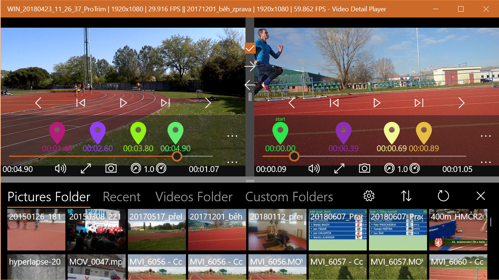

Video player for Windows 10/11 with features for detail analysis of movement.

[Available here](https://www.microsoft.com/en-us/p/video-detail-player/9p34ghb2h88r)

## Features

- Free app, no adds. Really!
- Play video in slow motion or frame by frame
- Take pictures from video 
- Zoom important details 
- Analyze intervals with markers mode 
- Play videos side by side 
- Controlled by touch, keyboard or mouse
- Navigate through video with markers
- Stores position in playback 
- Shows playback history 

## Known bugs

- Translation in Markers report is missing (From/To).
- You can send empty feedback messages.
- Shortcut for toggling Markes mode is same as for placing Marker (M).
- There is some issue with .m2ts filename extension.

## Feedback is welcome

